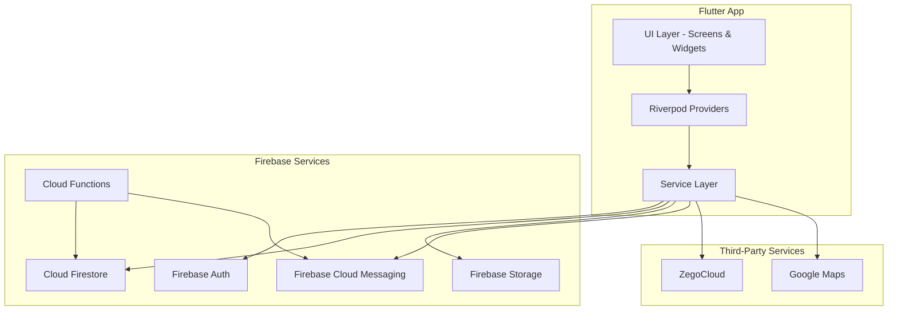
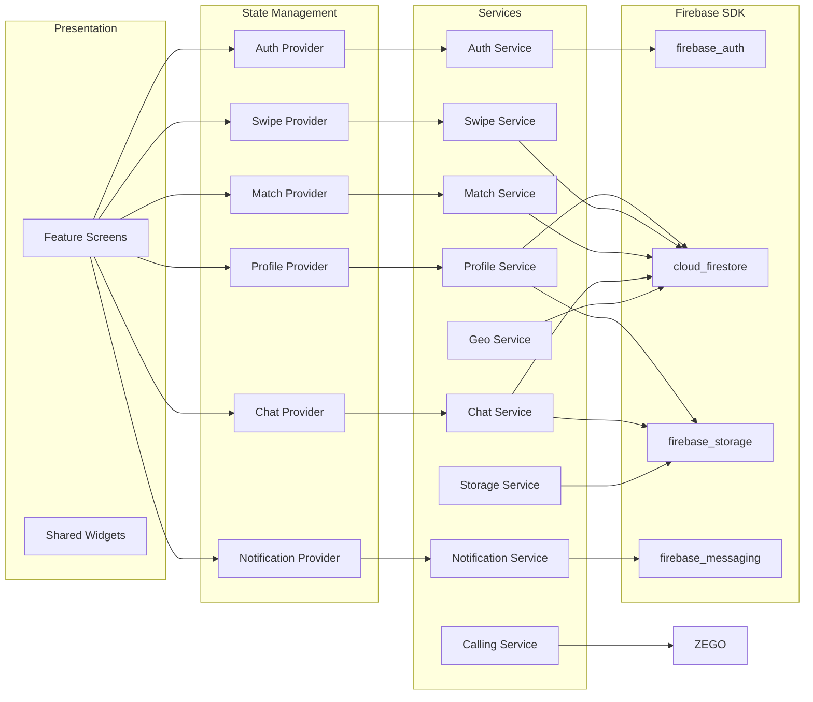
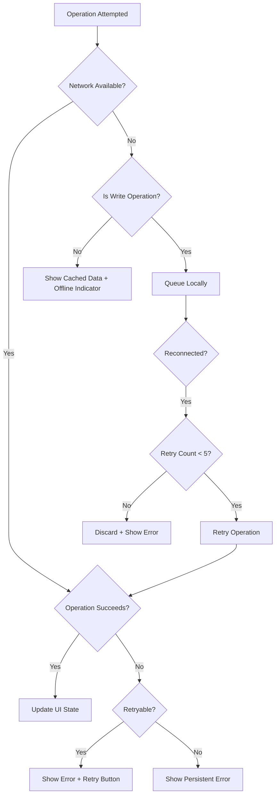

# Design Document: Firebase Dating App Migration

## Overview

This design describes the migration of the Yaaro0 dating app from a Flutter + Express.js architecture to a fully Firebase-based stack. The current app uses `ApiClient` with HTTP REST calls to a Railway-hosted Express.js backend and `socket_io_client` for real-time messaging. The migration replaces these with:

- **Firebase Auth** for phone OTP, Google Sign-In, and email/password authentication
- **Cloud Firestore** for all persistent data with real-time snapshot listeners
- **Firebase Storage** for photo uploads
- **Firebase Cloud Functions** for trusted server-side logic (match detection, notifications)
- **Firebase Cloud Messaging (FCM)** for push notifications
- **Riverpod** for state management (replacing `setState` and `InheritedWidget` patterns)
- **Geoflutterfire2** for geolocation-based user discovery
- **Google Maps Flutter** for map-based user visualization
- **ZegoCloud** for video and audio calling
- **appinio_swiper** for swipe card deck UI

The migration is destructive to the existing `core/api_client.dart`, `core/secure_storage.dart` (for auth tokens), and all socket-based real-time code. The Express.js backend at `/Users/jathusan/Desktop/Yaaro-backend` will be fully deprecated.

## Architecture

### High-Level System Architecture



### Layered Architecture



### Migration Strategy

The migration follows a feature-by-feature approach:
1. **Phase 1**: Firebase initialization, Auth migration (removes `ApiClient` auth endpoints)
2. **Phase 2**: Profile & Storage migration (removes profile REST calls)
3. **Phase 3**: Swipe, Match, and Discovery migration (removes discovery/swipe endpoints)
4. **Phase 4**: Chat migration (removes Socket.IO dependency)
5. **Phase 5**: Notifications, Calling, Favorites, Offline support
6. **Phase 6**: Express.js removal, Firestore security rules deployment, Cloud Functions deployment

### Key Design Decisions

| Decision | Choice | Rationale |
|----------|--------|-----------|
| State management | Riverpod (code generation) | Type-safe, testable, supports async/stream providers natively |
| Realtime data | Firestore snapshot listeners | Replaces Socket.IO; built-in offline sync; no server to maintain |
| Match detection | Cloud Functions (Firestore triggers) | Requires trusted execution; prevents client manipulation |
| Photo storage path | `users/{uid}/photos/{uuid}.jpg` | Aligns with security rules; UUID prevents filename collisions |
| Match ID format | Sorted UIDs joined with `_` | Deterministic; prevents duplicate match documents from race conditions |
| Geo queries | Geoflutterfire2 with geohash | Efficient Firestore range queries; no custom geo backend needed |
| Calling | ZegoCloud pre-built UI kit | Handles WebRTC complexity; no custom signaling server needed |

## Components and Interfaces

### 1. Firebase Initialization (`core/firebase_init.dart`)

Responsible for initializing all Firebase services before UI renders.

```dart
abstract class FirebaseInitService {
  /// Initializes Firebase Core, Auth, Firestore, Storage, and FCM.
  /// Throws [FirebaseInitException] if any service fails.
  /// Retries up to [maxRetries] times before throwing persistent error.
  Future<void> initialize({int maxRetries = 3});

  /// Configures Firestore offline persistence with default cache size.
  Future<void> configureOfflinePersistence();
}
```

### 2. Auth Service (`features/auth/data/firebase_auth_service.dart`)

```dart
abstract class FirebaseAuthService {
  /// Phone OTP flow
  Future<void> sendOtp(String phoneNumber); // E.164 format
  Future<UserCredential> verifyOtp(String verificationId, String otp);

  /// Google Sign-In flow
  Future<UserCredential> signInWithGoogle();

  /// Email/Password flow
  Future<UserCredential> registerWithEmail(String email, String password);
  Future<UserCredential> signInWithEmail(String email, String password);
  Future<void> sendPasswordResetEmail(String email);

  /// Session
  Stream<User?> get authStateChanges;
  User? get currentUser;
  Future<void> signOut();
}
```

### 3. Profile Service (`features/profile/data/profile_service.dart`)

```dart
abstract class ProfileService {
  /// Creates or updates the User_Document at users/{uid}
  Future<void> saveProfile(UserProfile profile);

  /// Retrieves User_Document as a real-time stream
  Stream<UserProfile?> watchProfile(String uid);

  /// Retrieves User_Document once
  Future<UserProfile?> getProfile(String uid);

  /// Checks if profile is complete (all required fields present)
  Future<bool> isProfileComplete(String uid);
}
```

### 4. Storage Service (`features/profile/data/storage_service.dart`)

```dart
abstract class PhotoStorageService {
  /// Compresses image to max 1080x1080 and 1MB, uploads to
  /// users/{uid}/photos/{uuid}.jpg, returns download URL
  Future<String> uploadPhoto(String uid, File imageFile);

  /// Provides upload progress stream (0.0 to 1.0)
  Stream<double> get uploadProgress;

  /// Deletes a photo by its storage path
  Future<void> deletePhoto(String storagePath);
}
```

### 5. Swipe Service (`features/swipe/data/swipe_service.dart`)

```dart
abstract class SwipeService {
  /// Records a like at likes/{uid}/liked/{targetUid}
  Future<void> like(String uid, String targetUid, {bool superLike = false});

  /// Records a dislike at likes/{uid}/disliked/{targetUid}
  Future<void> dislike(String uid, String targetUid);

  /// Fetches next batch of eligible profiles using geo and filter criteria
  Future<List<UserProfile>> fetchEligibleProfiles(String uid, {int limit = 10});
}
```

### 6. Match Service (`features/matches/data/match_service.dart`)

```dart
abstract class MatchService {
  /// Real-time stream of matches for the current user
  Stream<List<MatchDocument>> watchMatches(String uid);

  /// Gets a single match document
  Future<MatchDocument?> getMatch(String matchId);
}
```

### 7. Chat Service (`features/chat/data/chat_service.dart`)

```dart
abstract class ChatService {
  /// Real-time stream of messages ordered by timestamp
  Stream<List<ChatMessage>> watchMessages(String matchId);

  /// Sends a text message
  Future<void> sendTextMessage(String matchId, String senderId, String text);

  /// Sends an image message (uploads to Storage first)
  Future<void> sendImageMessage(String matchId, String senderId, File image);
}
```

### 8. Geo Service (`features/discover/data/geo_service.dart`)

```dart
abstract class GeoService {
  /// Updates user's location and geohash in Firestore
  Future<void> updateLocation(String uid, GeoPoint location);

  /// Queries nearby users within radius, applying filters
  Future<List<UserProfile>> queryNearbyUsers({
    required GeoPoint center,
    required double radiusKm,
    required DiscoveryFilters filters,
    required String excludeUid,
    required Set<String> excludedUids,
    int limit = 50,
  });
}
```

### 9. Notification Service (`features/notifications/data/notification_service.dart`)

```dart
abstract class NotificationService {
  /// Initializes FCM, requests permission, saves token
  Future<void> initialize(String uid);

  /// Handles token refresh
  Stream<String> get onTokenRefresh;

  /// Handles foreground notification display
  Future<void> showForegroundNotification(RemoteMessage message);

  /// Handles notification tap routing
  Future<void> handleNotificationTap(Map<String, dynamic> payload);
}
```

### 10. Calling Service (`features/calling/data/calling_service.dart`)

```dart
abstract class CallingService {
  /// Initializes ZegoCloud SDK
  Future<void> initialize(String appId, String appSign);

  /// Starts a video call between matched users
  Future<void> startVideoCall(String callerId, String callerName, String targetUid);

  /// Starts an audio call between matched users
  Future<void> startAudioCall(String callerId, String callerName, String targetUid);
}
```

### 11. Riverpod Providers (`features/*/providers/`)

```dart
// Auth state provider
final authStateProvider = StreamProvider<User?>((ref) {
  return ref.read(authServiceProvider).authStateChanges;
});

// User profile provider
final userProfileProvider = StreamProvider.family<UserProfile?, String>((ref, uid) {
  return ref.read(profileServiceProvider).watchProfile(uid);
});

// Matches list provider
final matchesProvider = StreamProvider<List<MatchDocument>>((ref) {
  final user = ref.watch(authStateProvider).value;
  if (user == null) return Stream.value([]);
  return ref.read(matchServiceProvider).watchMatches(user.uid);
});

// Chat messages provider
final chatMessagesProvider = StreamProvider.family<List<ChatMessage>, String>((ref, matchId) {
  return ref.read(chatServiceProvider).watchMessages(matchId);
});

// Discovery profiles provider
final discoveryProfilesProvider = FutureProvider<List<UserProfile>>((ref) async {
  final user = ref.watch(authStateProvider).value;
  if (user == null) return [];
  return ref.read(swipeServiceProvider).fetchEligibleProfiles(user.uid);
});
```

### 12. Cloud Functions (`functions/`)

```typescript
// Match detection trigger
exports.onLikeCreated = functions.firestore
  .document('likes/{uid}/liked/{targetUid}')
  .onCreate(async (snapshot, context) => {
    // Check for reciprocal like
    // Create match document if mutual
    // Send FCM notifications
  });

// Super like notification trigger
exports.onSuperLikeCreated = functions.firestore
  .document('likes/{uid}/liked/{targetUid}')
  .onCreate(async (snapshot, context) => {
    // Check if superLike field is true
    // Send immediate notification to target user
  });

// Chat notification trigger
exports.onNewMessage = functions.firestore
  .document('matches/{matchId}/messages/{messageId}')
  .onCreate(async (snapshot, context) => {
    // Send push notification to recipient if not in chat
    // Update lastMessage and lastMessageAt on match document
  });
```

### 13. Firestore Security Rules (`firestore.rules`)

```
rules_version = '2';
service cloud.firestore {
  match /databases/{database}/documents {
    // User documents
    match /users/{uid} {
      allow read: if request.auth != null;
      allow write: if request.auth.uid == uid
                   && !request.resource.data.diff(resource.data).affectedKeys().hasAny(['uid', 'createdAt']);
    }

    // Like/dislike documents
    match /likes/{uid}/{action}/{targetUid} {
      allow create: if request.auth.uid == uid;
      allow read: if request.auth.uid == uid;
      allow update, delete: if false;
    }

    // Match documents
    match /matches/{matchId} {
      allow read: if request.auth.uid in resource.data.users;
      allow write: if false; // Only Cloud Functions write matches

      // Messages subcollection
      match /messages/{messageId} {
        allow read: if request.auth.uid in get(/databases/$(database)/documents/matches/$(matchId)).data.users;
        allow create: if request.auth.uid in get(/databases/$(database)/documents/matches/$(matchId)).data.users
                      && request.resource.data.senderId == request.auth.uid;
      }
    }

    // Favorites subcollection
    match /users/{uid}/favorites/{targetUid} {
      allow read, write: if request.auth.uid == uid;
    }
  }
}
```

## Data Models

### UserProfile (User_Document at `users/{uid}`)

```dart
class UserProfile {
  final String uid;
  final String name;
  final int age;
  final String bio;
  final String gender;          // "Male", "Female", "Other"
  final String interestedIn;    // Comma-separated or list
  final List<String> photos;    // Download URLs
  final List<String> interests; // Selected interest chips
  final GeoPoint location;
  final String geohash;
  final DateTime createdAt;

  // Optional/filter fields
  final int? ageMin;            // Default: 18
  final int? ageMax;            // Default: 99
  final int? maxDistance;       // Default: 50 (km)
  final List<String>? interestedInGenders; // Filter preference

  // Internal fields (not exposed to other users via security rules)
  final String? fcmToken;
  final String? email;
  final String? phoneNumber;
}
```

### MatchDocument (at `matches/{matchId}`)

```dart
class MatchDocument {
  final String matchId;         // Sorted UIDs joined with "_"
  final List<String> users;     // Both participant UIDs
  final DateTime createdAt;
  final String? lastMessage;
  final DateTime? lastMessageAt;
  final Map<String, int> unreadCount; // {uid1: 0, uid2: 0}
}
```

### ChatMessage (at `matches/{matchId}/messages/{messageId}`)

```dart
class ChatMessage {
  final String messageId;
  final String senderId;
  final String text;
  final String type;            // "text" or "image"
  final DateTime timestamp;
  final String? imageUrl;       // For image messages
}
```

### LikeDocument (at `likes/{uid}/liked/{targetUid}` or `likes/{uid}/disliked/{targetUid}`)

```dart
class LikeDocument {
  final String targetUid;
  final bool superLike;         // Only on liked documents
  final DateTime createdAt;
}
```

### FavoriteDocument (at `users/{uid}/favorites/{targetUid}`)

```dart
class FavoriteDocument {
  final String targetUid;
  final String name;
  final String primaryPhotoUrl;
  final int age;
  final DateTime savedAt;
}
```

### DiscoveryFilters

```dart
class DiscoveryFilters {
  final int ageMin;             // 18-99, default 18
  final int ageMax;             // 18-99, default 99
  final int maxDistance;        // 1-100 km, default 50
  final List<String> interestedIn; // ["Male", "Female", "Other"]
}
```


## Correctness Properties

*A property is a characteristic or behavior that should hold true across all valid executions of a system — essentially, a formal statement about what the system should do. Properties serve as the bridge between human-readable specifications and machine-verifiable correctness guarantees.*

### Property 1: E.164 Phone Number Validation

*For any* string input to the phone number field, the validation function should accept the string if and only if it starts with '+' followed by 7 to 15 digits (inclusive), and reject all other strings with a validation error.

**Validates: Requirements 2.2**

### Property 2: Email and Password Input Validation

*For any* email and password pair, the validation function should reject the submission and indicate the specific failing field if the email does not conform to standard email format OR if the password length is less than 8 characters or greater than 128 characters. Valid submissions should be accepted.

**Validates: Requirements 4.5**

### Property 3: Profile Field Validation

*For any* combination of age, name, and bio values, the profile validation function should accept the input if and only if age is between 18 and 99 inclusive, name length is between 1 and 50 characters inclusive, and bio length is between 0 and 500 characters inclusive. Invalid inputs should produce an error indicating the specific failing field.

**Validates: Requirements 6.4**

### Property 4: Photo Upload File Validation

*For any* file submission, the validation function should accept the file if and only if its format is one of JPEG, PNG, or HEIC AND its size does not exceed 10 MB. Files that fail either condition should be rejected with an appropriate error message.

**Validates: Requirements 7.6**

### Property 5: Deterministic Paired-User ID Generation

*For any* two distinct user UIDs (A and B), the ID generation function (used for both match IDs and call IDs) should produce the same result regardless of argument order (commutative), and the result should equal the two UIDs sorted alphabetically and joined with an underscore character.

**Validates: Requirements 9.2, 14.2, 14.3**

### Property 6: Discovery Query Exclusion

*For any* set of user profiles returned by the discovery query, the result set should never contain the current user's own profile, nor any user whose UID exists in the current user's liked or disliked collections.

**Validates: Requirements 8.6, 10.5**

### Property 7: Discovery Filter Application

*For any* set of user profiles returned by a discovery or geo query with filter parameters applied, every profile in the result set must satisfy all three conditions: the user's age falls within the configured ageMin to ageMax range (inclusive), the user's distance from the querying user is within maxDistance kilometers, and the user's gender is contained in the interestedIn list.

**Validates: Requirements 10.4, 10.6, 12.6**

### Property 8: Chat Message Validation

*For any* string submitted as a chat message, the chat service should reject the message if the string is empty or composed entirely of whitespace characters, and should accept the message if the string contains at least one non-whitespace character and its length is between 1 and 5000 characters inclusive.

**Validates: Requirements 13.2, 13.7**

### Property 9: Notification Type Routing

*For any* notification payload with a type field in the set {"match", "message", "super_like"}, tapping the notification should navigate to the corresponding screen: "match" → match detail screen, "message" → chat screen for that conversation, "super_like" → profile screen of the sender. The mapping should be exhaustive for all defined types.

**Validates: Requirements 15.6**

### Property 10: Provider State Reset on Sign Out

*For any* combination of populated Riverpod provider states (auth user present, cached profile data, match list, chat messages, swipe state), invoking sign out should reset all providers to their initial unauthenticated state with no cached user data remaining in memory.

**Validates: Requirements 17.6**

### Property 11: Security Rule — Immutable System Fields

*For any* Firestore update operation on a User_Document that attempts to modify the `uid` or `createdAt` field, the Firestore security rules should deny the write, even if the requesting user is the document owner and all other fields in the update are valid.

**Validates: Requirements 19.1**

### Property 12: Security Rule — Message Sender Identity

*For any* message document creation in the `matches/{matchId}/messages` subcollection, if the `senderId` field in the document does not equal the authenticated user's UID, the Firestore security rules should deny the write.

**Validates: Requirements 19.3**

### Property 13: Security Rule — Unauthenticated Access Denial

*For any* Firestore read or write operation attempted without a valid authentication token, the Firestore security rules should deny the request regardless of collection, document path, or operation type.

**Validates: Requirements 19.6**

## Error Handling

### Error Categories

| Category | Source | Handling Strategy |
|----------|--------|-------------------|
| **Firebase Init Failure** | Firebase SDK | Show error screen with retry (max 3 attempts), then persistent error state |
| **Auth Errors** | Firebase Auth | Display specific error message (invalid OTP, expired code, network failure), allow retry |
| **Firestore Errors** | Cloud Firestore | Expose error state on Riverpod provider, show user-visible error with retry action |
| **Storage Errors** | Firebase Storage | Show error on affected photo, provide retry without losing selected image |
| **Network Errors** | Connectivity | Queue writes locally, show offline indicator, disable server-required actions |
| **Validation Errors** | User input | Display field-specific error messages, prevent form submission/progression |
| **Call Errors** | ZegoCloud | Terminate call attempt after 60s timeout, display connection error |
| **FCM Errors** | Firebase Messaging | Skip notification silently (non-blocking), continue with core operation |

### Error Flow



### Provider Error States

Each Riverpod provider exposes a tri-state:
- **Loading**: Initial fetch or refresh in progress
- **Data**: Successfully loaded content
- **Error**: Contains human-readable error message and retry callback

```dart
sealed class AsyncState<T> {
  const AsyncState();
}
class Loading<T> extends AsyncState<T> {}
class Data<T> extends AsyncState<T> { final T value; }
class Error<T> extends AsyncState<T> { 
  final String message; 
  final VoidCallback retry;
}
```

### Validation Error Display

- Field-level errors appear below the relevant input widget
- Form-level errors appear in a snackbar or banner at the top of the form
- Validation runs on submit (not on every keystroke) to avoid noise
- The specific failing field is identified in the error message

## Testing Strategy

### Testing Approach

This migration uses a dual testing approach:

1. **Property-based tests** — Verify universal properties that must hold across all valid inputs (validation logic, ID generation, filter logic, security rules)
2. **Unit tests** — Verify specific examples, edge cases, and error conditions for deterministic behaviors
3. **Integration tests** — Verify Firebase service interactions using Firebase Emulator Suite
4. **Widget tests** — Verify UI rendering and navigation logic

### Property-Based Testing Configuration

- **Library**: `dart_check` (Dart property-based testing library)
- **Minimum iterations**: 100 per property test
- **Tag format**: `Feature: firebase-dating-app-migration, Property {number}: {property_text}`

Each correctness property from the design document maps to exactly one property-based test:

| Property | Test Focus | Generator Strategy |
|----------|------------|-------------------|
| P1: E.164 Validation | Phone number strings | Random strings, valid E.164 strings, near-miss strings |
| P2: Email/Password Validation | Email format + password length | Random strings, valid/invalid emails, passwords of varying length |
| P3: Profile Field Validation | Age/name/bio ranges | Random integers 0-200, random strings 0-1000 chars |
| P4: File Upload Validation | Format + size | Random file extensions, random sizes 0-50MB |
| P5: Deterministic ID | UID pairs | Random alphanumeric strings as UIDs |
| P6: Query Exclusion | User sets + exclusion sets | Random user lists with known overlap |
| P7: Filter Application | User attributes + filter params | Random ages, distances, genders with filter configs |
| P8: Message Validation | Message strings | Random strings including whitespace-only, empty, and valid content |
| P9: Notification Routing | Notification types | All defined types with random payloads |
| P10: Provider Reset | Provider states | Random populated state combinations |
| P11-13: Security Rules | Firestore operations | Random field updates, auth states, collection paths |

### Unit Tests

Unit tests cover:
- Firebase initialization retry logic (mock service failures)
- OTP retry counting and lockout behavior
- Profile setup flow step progression and validation
- Photo count boundary (0, 1, 6, 7 photos)
- Interest selection count (2, 3, 10, 11 selections)
- Empty card stack behavior
- Match creation with correct document structure
- Notification permission handling (granted/denied)
- Offline queue behavior (queue, retry, discard after 5 failures)
- ZegoCloud call rejection without match

### Integration Tests (Firebase Emulator)

Integration tests verify:
- End-to-end auth flows (phone, Google, email)
- Firestore document CRUD operations
- Security rules enforcement (using Firestore emulator rules testing)
- Cloud Function triggers (like → match detection → notification)
- FCM token storage and refresh
- Geo queries via Geoflutterfire2 against emulator
- Offline persistence and sync behavior

### Widget Tests

Widget tests verify:
- Profile setup stepper renders 5 steps in order
- Swipe card stack displays correct user data
- Filter sliders have correct bounds and defaults
- Chat message list renders in timestamp order
- Offline indicator visibility
- Error screens with retry buttons
- Navigation routing on notification tap
